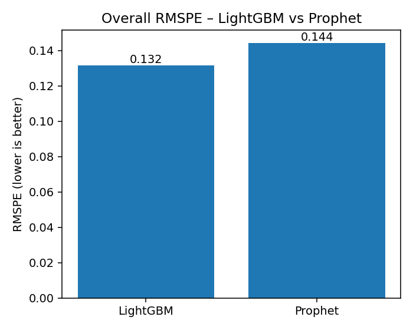
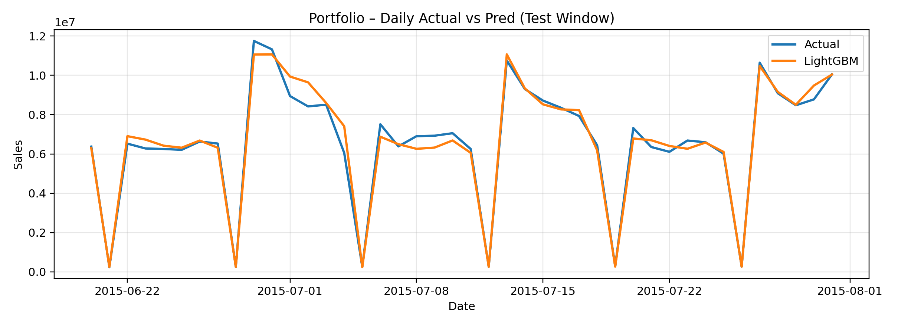
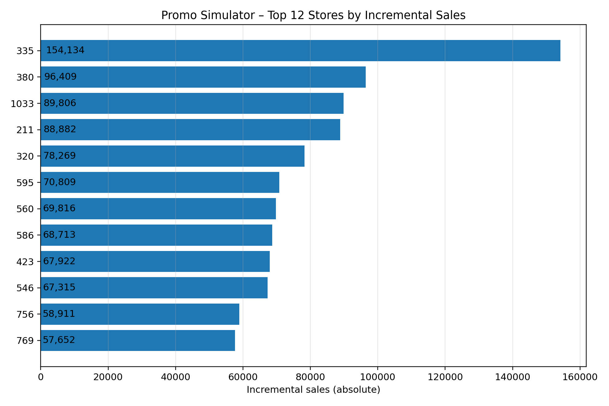

# Rossmann Forecast & Promo Impact

**End-to-end retail forecasting + promotion uplift with Python (LightGBM & Prophet) and Tableau**

**Live Dashboard**  
https://public.tableau.com/app/profile/emre.pelzer/viz/RossmannPerformanceForecastDashboard/RossmannForecastPromoImpact

**Contact**  
Emre Pelzer · emrepel03@gmail.com · [LinkedIn](https://www.linkedin.com/in/emre-pelzer-b14148324) · [GitHub](https://github.com/emrepel03) · [Portfolio](https://www.datascienceportfol.io/emrepel03)

---

## Highlights

- **Forecasting:** Store-level daily sales using **LightGBM** (primary) and **Prophet** (baseline).
- **Accuracy:** **RMSPE 0.1315** (LightGBM) vs **0.1443** (Prophet) on the test window **2015‑06‑20 → 2015‑07‑31**.
- **Promotion “what‑if” simulator:** Counterfactual baseline vs promo at daily, store level.
- **Estimated impact:** **~10.29% weighted uplift** across the simulated window (top stores much higher).
- **Business outputs:** Tableau dashboards (Forecast Viewer, Promo Impact, Model comparison) plus weekly promo action tables.

Color theme: Rossmann Red `#E6001A` (Actual) and Teal `#007F7F` (Predicted).

---

## Screenshots

> If these images don’t render on GitHub, copy the matching PNGs into the paths below or update the links.





---

## Repository Structure

```
reports/
  figures/                      # core PNGs for README & Tableau
  metrics/                      # metrics CSVs and Optuna trials
  portfolio/                    # action tables (promo, demand, competition risk)
  predictions/                  # lgbm_test_predictions.csv (test window preds)
  promo_sim/                    # what-if outputs (lift_by_store_day, summaries)
  tableau/                      # tidy CSVs for Tableau + workbook(s)

scripts/
  modeling.py                   # trains LightGBM with Optuna
  compare_models.py             # LGBM vs Prophet evaluation + plots
  evaluate_by_store.py          # per-store error breakdown & figs
  predict.py                    # batch prediction
  promo_simulator.py            # counterfactual promo uplift
```

---

## Reproduce Locally

**1 Environment**

```bash
python -m venv .venv
source .venv/bin/activate
pip install -r requirements.txt
```

**2 Train & Evaluate**

```bash
python scripts/modeling.py --wide_path data/processed/rossmann_features_wide.csv --n_trials 200 --test_days 42 --val_days 42
python scripts/compare_models.py
python scripts/evaluate_by_store.py --preds_path reports/predictions/lgbm_test_predictions.csv --wide_path data/processed/rossmann_features_wide.csv
```

**3 Promo Simulator (what‑if)**

```bash
python scripts/promo_simulator.py --wide_path data/processed/rossmann_features_wide.csv --model_path models/lightgbm_sales.pkl --start 2015-06-20 --end 2015-07-31 --stores_top_k 25 --out_dir reports/promo_sim
```

This produces:
- `reports/promo_sim/lift_by_store_day.csv`
- `reports/promo_sim/lift_summary_by_store.csv`
- charts in `reports/promo_sim/`

---

## Tableau – How to Open

Connect to these tidy sources (relationships, not physical joins) in **Data Model**:

From `reports/tableau/`  
- `test_predictions.csv` (grain: Store, Date)  
- `promo_lift_by_store_day.csv` (relate on Store + Date)  
- `by_store_compare.csv` (relate on Store)  
- `overall_summary.csv` (use on Overview only)

From `reports/portfolio/`  
- `promo_actions.csv` (relate on Store + Week Start)  
- `high_demand_weeks.csv` (relate on Store + Week Start)  
- `competition_hotspots.csv` (relate on Store)

Two pages in the public workbook:
1. **Forecast & Promo Impact** – KPI tiles, Forecast Viewer (Actual vs Pred), Promo Top Stores, Model accuracy.
2. **Profit & Runners‑Up** – Profit uplift scatter (assumes margin parameter) and per‑store uplift runners‑up.

---

## Modeling Notes (brief)

- **Features (50):** calendar (dow, week, month), promo flags, holidays, lag/rolling stats, competition distance/recency, etc.
- **Tuning:** Optuna over learning rate, leaves, depth, subsampling, regularization; pruning with early stopping; RMSPE on val.
- **Metric:** RMSPE (scale-robust across stores) + RMSE & MAPE for stakeholder clarity.
- **Validation:** Walk‑forward splits (val/test 6 weeks each), strict anti‑leakage on lags/rolls.

---

## Business Outputs

- **Promo Actions:** Weekly recs by store (expected absolute lift, avg % lift, priority) → `reports/portfolio/promo_actions.csv`.
- **High‑Demand Weeks:** Elevated demand flags per store/week → `reports/portfolio/high_demand_weeks.csv`.
- **Competition Hotspots:** Risk score blending proximity + recency → `reports/portfolio/competition_hotspots.csv`.

---

## Data

- Source: Kaggle **Rossmann Store Sales** (public).  
- Processed feature table: `data/processed/rossmann_features_wide.csv` (not committed due to size).  
- Predictions, metrics, figures, and Tableau‑ready CSVs live under `reports/`.

---

## What’s Next

- Add weekly seasonality features per store type; test CatBoost/XGBoost ablations.  
- Parameterize promo simulator by **budget** and **margin** to surface **profit‑optimal** allocations.  
- Optional: schedule retraining with GitHub Actions + publish fresh extracts for Tableau Public.

---

## License

MIT (see `LICENSE`).  
If you reuse the Kaggle dataset, please comply with its license/terms.

---